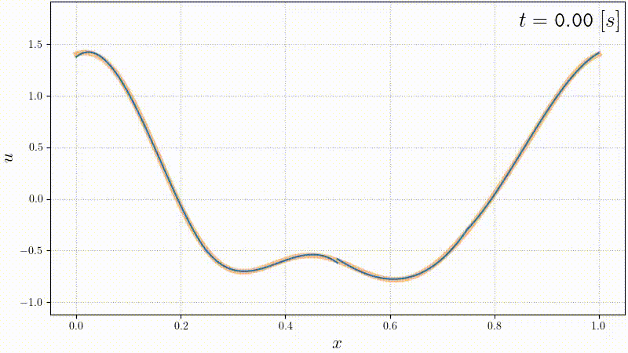
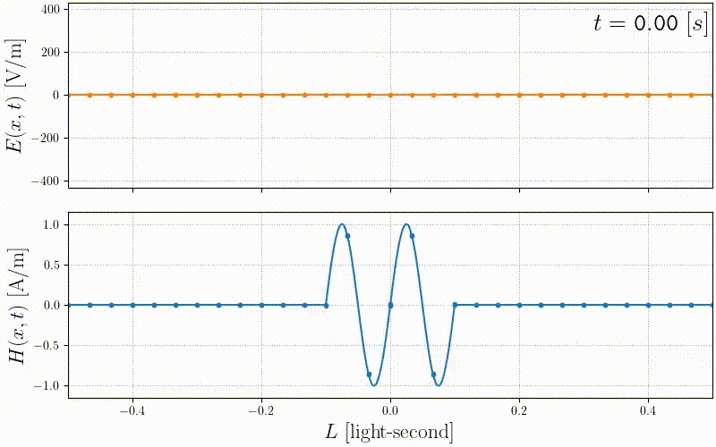

# Discontinuous Galerkin method - LMECA2300

## Homework 1 - Scalar advection (1D)

## Homework 2 - Maxwell equations (1D)

## Homework 3 - Scalar advection (2D)

## Homework 4 - Linearized Euler Equations (2D)

